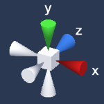

# Runtime Scene Gizmo for Unity

**Available on Asset Store:** https://assetstore.unity.com/packages/tools/gui/runtime-scene-gizmo-123040

**Forum Thread:** https://forum.unity.com/threads/runtime-scene-gizmo-for-ugui-open-source.540011/

**[Support the Developer ☕](https://yasirkula.itch.io/unity3d)**

This plugin helps you display a runtime scene gizmo as a UI element in your Unity projects. An event is raised when a component of the gizmo is clicked.

## HOW TO

After importing [RuntimeSceneGizmo.unitypackage](https://github.com/yasirkula/UnityRuntimeSceneGizmo/releases) to your project, simply add **Plugins/RuntimeSceneGizmo/Prefabs/GizmoRenderer** to your UI canvas and position it as you like. Gizmo will always have 1:1 aspect ratio and, by default, will be placed at the top-right corner of *GizmoRenderer*. You can change the **RenderTarget** child object's pivot for a different placement.

To invoke a function when a gizmo component is clicked, use the **On Component Clicked** event of the *GizmoRenderer* object. Functions registered to this event should ideally take a **GizmoComponent** parameter (which is defined in **RuntimeSceneGizmo** namespace).

Gizmo's rotation will match the main camera's rotation but it is possible to change the reference object via *GizmoRenderer*'s **Reference Transform** property.

GizmoRenderer will automatically create an instance of **SceneGizmo** prefab in your scene. SceneGizmo uses a camera to render the gizmo to a *RenderTexture*, which is then used by the GizmoRenderer to display the gizmo on the canvas. By default, SceneGizmo objects use layer 24 but this can be adjusted via *SceneGizmoController.GIZMOS_LAYER* constant.

See **Plugins/RuntimeSceneGizmo/Demo/DemoScene** for an example scene.
